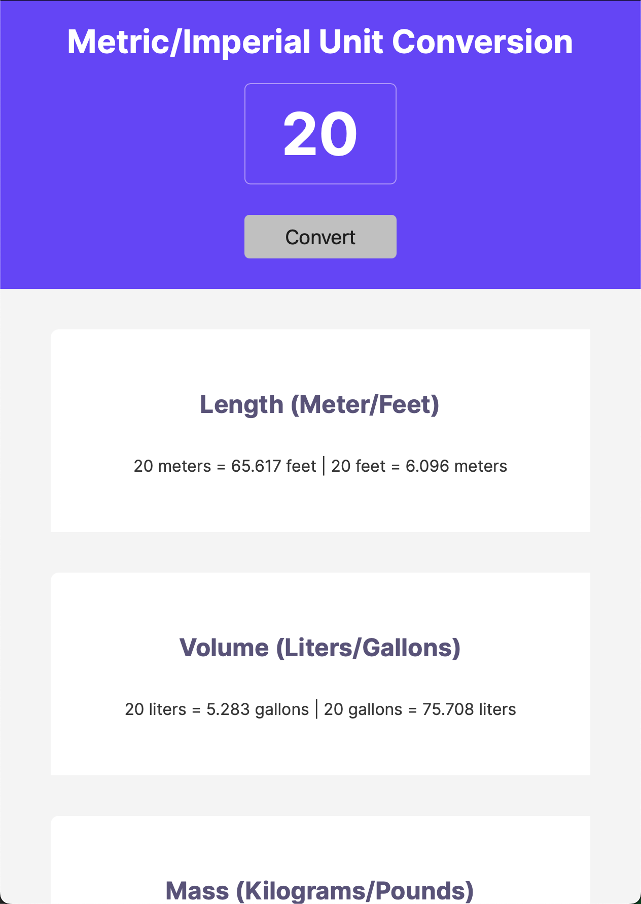

# 🌍 Unit Converter

A simple **Metric ↔ Imperial Unit Converter** built as part of the [Scrimba Frontend Developer Path](https://scrimba.com/).  
This project lets you quickly convert between **length, volume, and mass** using a single input.

---

## ✨ Features

- Convert between:
  - **Length**: meters ↔ feet
  - **Volume**: liters ↔ gallons
  - **Mass**: kilograms ↔ pounds
- Clean, minimal UI
- Built with **HTML**, **CSS**, and **JavaScript**
- Instant conversion with one click

---

## 🚀 Demo

  

Live Link: https://iamtreymcgill-unit-converter.netlify.app/

---

## 🛠️ Technologies Used

- **HTML5** for structure  
- **CSS3** for styling  
- **Vanilla JavaScript** for logic and DOM manipulation  

---

## 📖 How It Works

1. Enter a number in the input field.  
2. Click **Convert**.  
3. See the results for all three categories (Length, Volume, Mass).  

Example:  
- 10 meters = 32.808 feet | 10 feet = 3.048 meters
- 10 liters = 2.642 gallons | 10 gallons = 37.854 liters
- 10 kilos = 22.046 pounds | 10 pounds = 4.536 kilos

---

## ⚡ Getting Started

To run the project locally:

1. Clone the repository:
   ```bash
   git clone https://github.com/iamtreymcgill/Unit-Converter.git

## 📚 Lessons Learned
- Practiced using objects to store conversion factors.
- Learned to create reusable functions for conversions.
- Improved understanding of event listeners and DOM manipulation.

⸻

## 🌱 Future Improvements
- Add more unit categories (temperature, speed, etc.)
- Allow users to choose conversion direction with dropdowns
- Improve design with better styling and responsiveness

⸻

## 🙌 Acknowledgments

This project was built as part of the Scrimba Frontend Developer Path.
Big thanks to Scrimba for making coding fun and interactive!